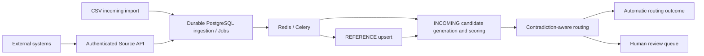

# Identity Resolution Workbench

A multi-tenant workbench for resolving duplicate and stale identities without letting a high similarity score override contradictory identity evidence.

## Live staging

[Open the public staging workbench](https://contact-resolution-workbench-productization-v1.vercel.app). Choose the anonymous demo or sign in. Use synthetic data only.

## Why this exists

Businesses accumulate outdated contact details and duplicate identities across systems. Exact matching misses legitimate changes; loose fuzzy matching can incorrectly join different people, including family members with similar names.

AI handles ambiguous evidence. Deterministic constraints protect identity. Humans handle uncertainty.

## How companies use it

### Initial onboarding / ad-hoc

Upload a CSV of incoming identities to create resolution Cases. Inspect candidates, field evidence and contradictions, then record a human decision. CSV export preserves those decisions. The current CSV importer creates Cases; persisted master/reference records are loaded through a REFERENCE Source.

### Ongoing operation

Create a **REFERENCE Source** for master records and an **INCOMING Source** for identities requiring resolution. External applications submit canonical batches using a Source-specific API key and an Idempotency-Key. Owners can rotate keys or disable ingestion; members can inspect processing history. Both incoming paths use the same deterministic scoring, contradiction checks and review workflow.

See the [Source API contract](docs/sources.md) for the schema and retry behavior.

## Architecture



```text
React / Vercel Preview -> Firebase staging -> FastAPI / Northflank -> Neon staging
                                                  |
                                            private Redis -> Celery

Explicit investigation -> LangGraph -> governed MCP -> approved evidence
                                    -> deterministic re-analysis -> human interrupt
```

Automatic routing recommends an outcome; it does not silently merge records or submit a reviewer decision. LangGraph/MCP is implemented and locally tested, but has not been executed in public staging.

## Capabilities

- Verified Firebase authentication and workspace membership checks.
- Durable asynchronous CSV and Source ingestion, credential lifecycle, HTTP/task idempotency and provenance.
- Deterministic candidate scoring with 75/45 thresholds; suffix and full-middle-name contradictions block likely-match routing.
- Human review, evidence inspection, audit history and spreadsheet-safe export.
- Governed LangGraph/MCP investigations and optional privacy-safe OTel/Langfuse tracing.

## Evaluation evidence

| Experiment | Held-out synthetic evidence | Decision |
| --- | --- | --- |
| Deterministic retrieval | Recall@1 92.91%; Recall@5 and Recall@10 100% | Retained deterministic approach |
| Routing at 75/45 | 99 automatic matches; **0 unsafe automatic decisions observed in the held-out synthetic benchmark**; review/abstention 23.85%; true-match rejection 6/127 | Thresholds retained |
| MiniLM retrieval | Underperformed deterministic top-1 | Rejected from runtime |
| Logistic Regression / XGBoost ranking | Improved synthetic top-1; feature investigation exposed a missing-field dataset artifact | Both rejected from runtime |

These measurements describe the versioned benchmark, not production accuracy or the database provider's 100-candidate cap. Gemini embedding performance is unassessed. Offline DeepEval checks validate scripted contracts and tool governance; their 1.0 results are not live model accuracy. [Methods and artifacts](docs/identity-resolution-benchmark.md).

## Deployment

The verified portfolio environment is **staging**: Vercel Preview, Firebase staging, Northflank API/worker, private Redis and an isolated Neon branch/database. API, worker and migration workload share the backend image. Kubernetes is validated with kind; it is not the public hosting platform. Optional telemetry exporters are disabled in public staging.

The existing Vercel/Render demo and its production Neon/Firebase configuration remain separate. A production cutover would require a separate controlled release decision. Terraform was evaluated and intentionally not adopted because the currently managed infrastructure does not benefit from adding Terraform state.

## Local development

Requires Python 3.13+, uv, Node.js 22+ and Docker for the shared database/broker.

```sh
# Repository root: local PostgreSQL, Redis, API and worker
docker compose build api
docker compose up -d postgres redis
docker compose run --rm api alembic upgrade head
docker compose run --rm api python -m app.services.investigation_service
docker compose up -d worker
docker compose run --rm --service-ports -e FIREBASE_SERVICE_ACCOUNT_JSON api

# Separate terminal
cd frontend
npm ci
npm run dev
```

Supply Firebase Admin JSON in the terminal environment before starting the API; Compose forwards it with `-e` without embedding it in an image. Configure the public browser SDK fields in `frontend/.env.local`; use the example files as references. Keep credentials outside Git and container images. Local SQLite is useful for unit tests; separate API/worker processes should share PostgreSQL. Gemini and exporter credentials are optional for deterministic ingestion and need separate worker environment injection when enabled.

## Testing

```sh
cd backend
uv sync --frozen --group ai-evaluation
uv run --frozen --group ai-evaluation pytest
uv run --frozen --group ai-evaluation ruff check .
uv run --frozen --group ai-evaluation ruff format --check .
uv run --frozen --group ai-evaluation mypy app
uv run --frozen --group ai-evaluation python -m benchmarks.ai_evaluation

cd ../frontend
npm ci
npm run lint
npx tsc --noEmit
npm run build
npm audit
```

Real broker/worker and PostgreSQL checkpoint tests run separately against disposable services, as in [CI](.github/workflows/ci.yml). See the [final audit](docs/final-audit.md) for results, dependency audits and reproduction details. No paid live judge is required.

## Security/privacy

User APIs authorize the verified user's workspace membership. Machine ingestion derives its workspace and purpose from its Source credential. Source tokens contain 256 bits of secret randomness; only a safe lookup prefix and SHA-256 digest are stored. Keys appear only in create/rotate responses and transient UI state.

OTel/Langfuse export allowlisted operation metadata, excluding identities, source rows, prompts, responses and credentials; exporter failures do not change domain outcomes. First-party demo usage events retain bounded identifiers; do not place personal data in case numbers or referral codes. The public environment is for synthetic data.

## Known limitations

- Synthetic benchmarks establish no real-world false-merge guarantee; Gemini embeddings and a live DeepEval judge were not evaluated.
- Workspace reference retrieval takes at most 100 blocked records, ordered by internal ID. Larger blocks can omit the true candidate; benchmark recall does not validate this database cap.
- Hard worker termination can strand PENDING/RUNNING Jobs. Recovery is operator-controlled; see the [crash analysis and runbook](docs/final-audit.md#worker-crash-analysis-and-manual-recovery).
- LangGraph/MCP has local integration evidence, not public-staging execution evidence. Approved additional retrieval is currently synthetic.
- Public staging uses Northflank Sandbox resources, with no availability/scale SLA; kind validation does not establish production Kubernetes readiness.
- One transient initial worker failure was observed during staging deployment. Subsequent complete end-to-end flows passed; root cause was not established.

## Documentation links

- [Architecture and component boundaries](docs/productization-architecture.md)
- [Project evidence, product vision, interview explanation and resume bullets](docs/project-evidence.md)
- [Final engineering/security audit](docs/final-audit.md)
- [Source API and ongoing ingestion](docs/sources.md)
- [Identity benchmark](docs/identity-resolution-benchmark.md) / [AI evaluation](docs/ai-evaluation.md)
- [Evidence investigations](docs/evidence-investigation.md)
- [E4 acceptance](docs/e4-verification.md) / [public staging](docs/staging-preview.md)
- [Northflank runbook](infrastructure/northflank/README.md) / [Kubernetes/kind](infrastructure/k8s/README.md)
