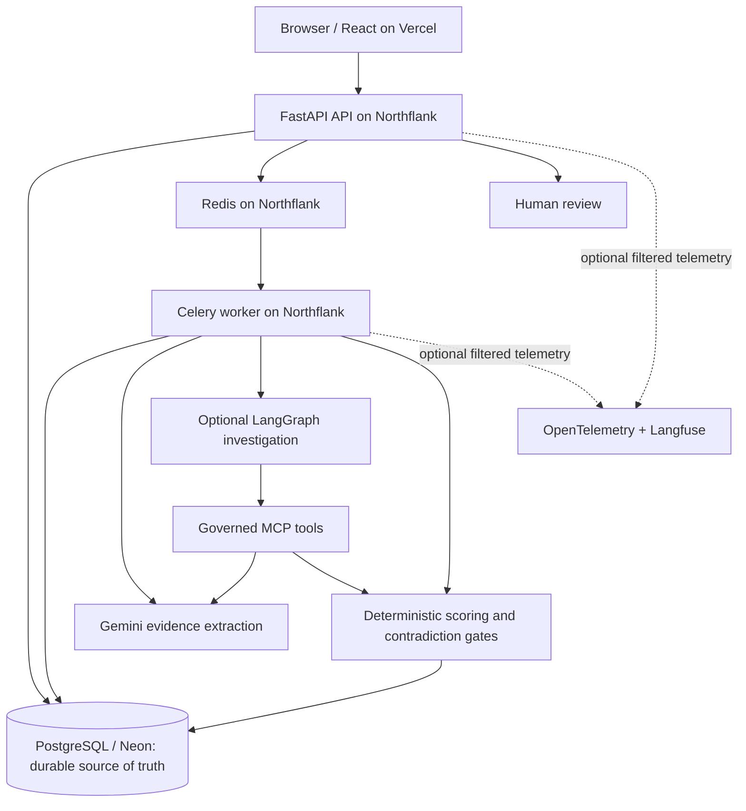

# Contact Resolution Workbench

A multi-tenant workbench for safely reviewing stale, duplicated and fragmented contact records. Deterministic identity rules score and route candidates; Gemini assists with evidence extraction, optional LangGraph investigations explore ambiguous evidence, and humans make final review decisions. Contradictions can block unsafe automatic likely-match assumptions.

## Live portfolio

[Open Contact Resolution Workbench](https://contact-resolution.vercel.app). Choose the anonymous demo or sign in. Use synthetic data only.

The live portfolio deployment uses React/Vercel, Firebase, FastAPI on Northflank,
Neon/PostgreSQL and Redis/Celery. See the [engineering evidence](docs/project-evidence.md)
for tests, synthetic benchmarks and deployment checks. Automatic routing recommends
an outcome; it does not silently merge records or submit a reviewer decision.

## Why this exists

Businesses accumulate outdated contact details and duplicate identities across systems. Exact matching misses legitimate changes; loose fuzzy matching can incorrectly join different people, including family members with similar names.

Optional Gemini extraction turns unstructured notes into schema-validated fields. LangGraph/MCP investigations check extracted values against approved evidence and rerun deterministic analysis. AI cannot set scores, choose a workspace, override contradiction gates or submit the reviewer's Accept/Reject decision. Investigation retrieval currently uses approved synthetic notes. PostgreSQL checkpoint restoration has local real-service and earlier production evidence; clean investigation acceptance on the latest release is pending. AI-extracted evidence is unverified, and no calibrated confidence percentage is supplied.

## Data ingestion

### Initial onboarding / ad-hoc

Upload a CSV of incoming identities to create resolution Cases. Inspect candidates, field evidence and contradictions, then record a human decision. CSV export preserves those decisions. The current CSV importer creates Cases; persisted master/reference records are loaded through a REFERENCE Source.

CSV uploads use UTF-8 (with or without a BOM), at most 256,000 bytes and 100 data
records. Required headers are `case_number,full_name`; optional headers are
`source_identifier,old_email,old_phone,employer,location`. Headers are case-sensitive;
their order and surrounding whitespace do not matter. Unknown, empty or duplicate
headers, inconsistent column counts, invalid quoting, blank records, missing required
values, and values exceeding database storage bounds reject the **entire file**.
Empty and header-only files are rejected. Optional values may be empty. Email and
phone format validation is not imposed; original Unicode and formula-like prefixes
are preserved in raw values (surrounding whitespace is trimmed). Existing CSV export
formula protection remains in place.

Case numbers are unique within a workspace. Duplicate case numbers within a file or
already in that workspace reject the whole upload; re-uploading the same file adds
zero Cases and reports failure explicitly. `source_identifier` is provenance, not a
deduplication key, and may repeat. Redelivery of the same completed Job is a no-op.

Upload HTTP 202 means queued, **not imported**. Read the scoped Job until it is
terminal. `SUCCEEDED.successful_rows` counts Cases read back from the inserted batch;
Cases and this result are committed together. Validation/persistence failure imports
zero Cases. `total_rows` counts logical data records (including blanks) when readable;
it is null when a reliable total is unavailable. For readable validation failures,
`rejected_rows` counts the entire rejected batch and `failure_message` describes the
first issue using a row number or safe grouped reason. Row numbers identify logical
records (header is 1); malformed quoting reports a physical line. The API never
returns raw row values in failure diagnostics. A lost polling response leaves the
outcome unknown: check Jobs before re-uploading.

### Ongoing operation

Create a REFERENCE Source for master records and an INCOMING Source for identities requiring resolution. External applications submit ongoing machine-to-machine batches using a Source-specific API key and an Idempotency-Key. Owners can rotate keys or disable ingestion; members can inspect processing history. Both incoming paths use the same deterministic scoring, contradiction checks and review workflow.

See the [Source API contract](docs/sources.md) for the schema and retry behavior.

## Runtime architecture



PostgreSQL owns durable workspace, Case, Job, evidence and checkpoint state. Redis
and Celery carry asynchronous work. MCP exposes constrained, reauthorized actions;
it provides no arbitrary database access. Optional telemetry integration is
implemented and tested; public exporters remain disabled.

## Capabilities

- Verified Firebase authentication and workspace membership checks.
- Durable asynchronous CSV and Source ingestion, credential lifecycle, HTTP/task idempotency and provenance.
- Deterministic candidate scoring with 75/45 thresholds; suffix and full-middle-name contradictions block likely-match routing.
- Human review, evidence inspection, audit history and spreadsheet-safe export.
- Governed LangGraph/MCP investigations and optional privacy-safe OTel/Langfuse tracing.

## Evaluation evidence

| Experiment | Held-out synthetic evidence | Decision |
| --- | --- | --- |
| Deterministic retrieval | Recall@1 92.91%; Recall@5 and Recall@10 100% | Retained deterministic approach |
| Routing at 75/45 | 99 automatic likely matches; **0 unsafe automatic decisions observed in the held-out synthetic benchmark**; review/abstention 23.85%; true-match rejection 6/127 | Thresholds retained |
| MiniLM retrieval | Underperformed deterministic top-1 | Rejected from runtime |
| Logistic Regression / XGBoost ranking | 97.64% R@1 in the synthetic experiment; gains materially reflected synthetic missing-field artifacts | Both rejected from runtime |

The corpus contains 880 synthetic identities, 2,600 records, 880 queries and 1,720 candidates across 22 scenarios. These measurements describe the versioned benchmark, not production accuracy or the database provider's 100-candidate cap. Gemini embedding performance is unassessed. Offline DeepEval checks validate scripted contracts and tool governance; their 1.0 results are not live model accuracy. [Methods and artifacts](docs/identity-resolution-benchmark.md).

## Deployment

The portfolio architecture uses Vercel for React, Northflank for the FastAPI API,
Celery worker and private Redis, and Neon for durable PostgreSQL. Firebase provides
authentication. API, worker and migration workload share a backend image.
Kubernetes manifests and kind runs validate the architecture locally and in CI;
Kubernetes is not the live hosting environment. Render is retained only in the
[historical cutover/rollback record](docs/production-cutover.md). Terraform is not
implemented infrastructure. This synthetic portfolio has no availability or scale SLA.

### Current release verification status

The 10–11 October 2026 API/worker rollout and bounded synthetic AI provenance and
investigation acceptance are recorded in the [production release acceptance](docs/production-release-acceptance-2026-10-11.md).
Those deployment observations were user-confirmed; the frontend's exact deployed
SHA remains unverified. This does not establish long-term memory stability or
unrestricted SaaS readiness. See the [final readiness audit](docs/final-readiness-audit-2026-10-04.md)
for earlier evidence and continuing operational limitations.

Frontend pushes to `main` can trigger Vercel releases; they do not prove deployment
or acceptance. Backend releases require deliberate coordinated release and migration.

## Controlled synthetic demo

1. Sign in or choose the anonymous demo.
2. Open Cases.
3. Upload a supported synthetic CSV or use AI extraction.
4. Inspect candidate evidence and contradictions.
5. Record a human Case review decision.
6. Explore Sources and ingestion history.
7. Demonstrate a bounded synthetic investigation; see the [October release acceptance](docs/production-release-acceptance-2026-10-11.md) and its limitations.
8. Inspect AI provenance and the retained source note where available; evidence remains unverified and extracted role is nonscored context.

New AI-ingested Cases preserve the exact originating Job. An authorized reviewer
can retrieve its retained source note through a workspace-scoped API. Extracted
job title is context only: role is not scored. AI evidence is labelled unverified;
no confidence percentage is invented. Historical Cases show unavailable context
rather than guessed provenance. [Implementation evidence](docs/f11-ai-provenance-implementation-2026-10-04.md).

## Local development

Requires Python 3.13+, uv, Node.js 22+ and Docker for the shared database/broker.

```sh
# Repository root: local PostgreSQL, Redis, API and worker
docker compose build api
docker compose up -d postgres redis
docker compose run --rm api python -m app.migrate
docker compose up -d worker
docker compose run --rm --service-ports -e FIREBASE_SERVICE_ACCOUNT_JSON api

# Separate terminal
cd frontend
npm ci
npm run dev
```

Supply Firebase Admin JSON in the terminal environment before starting the API; Compose forwards it with `-e` without embedding it in an image. Configure the public browser SDK fields in `frontend/.env.local`; use the example files as references. Keep credentials outside Git and container images. Local SQLite is useful for unit tests; separate API/worker processes should share PostgreSQL. Gemini and exporter credentials are optional for deterministic ingestion and need separate worker environment injection when enabled.

## Testing

```sh
cd backend
uv sync --frozen --group ai-evaluation
uv run --frozen --group ai-evaluation pytest
uv run --frozen --group ai-evaluation ruff check .
uv run --frozen --group ai-evaluation ruff format --check .
uv run --frozen --group ai-evaluation mypy app
uv run --frozen --group ai-evaluation python -m benchmarks.ai_evaluation

cd ../frontend
npm ci
npm run lint
npx tsc --noEmit
npm run build
npm audit
```

Real broker/worker and PostgreSQL checkpoint tests run separately against disposable services, as in [CI](.github/workflows/ci.yml). See the [final readiness audit](docs/final-readiness-audit-2026-10-04.md) for current verification scope and the [historical audit](docs/final-audit.md) for earlier reproduction details. No paid live judge is required.

## Security/privacy

User APIs authorize the verified user's workspace membership. Machine ingestion derives its workspace and purpose from its Source credential. Source tokens contain 256 bits of secret randomness; only a safe lookup prefix and SHA-256 digest are stored. Keys appear only in create/rotate responses and transient UI state.

OTel/Langfuse export allowlisted operation metadata, excluding identities, source rows, prompts, responses and credentials; exporter failures do not change domain outcomes. First-party demo usage events retain bounded identifiers; do not place personal data in case numbers or referral codes. Server-side provider secrets stay outside browser bundles. AI source notes remain in the originating Job rather than being duplicated into Case metadata; source-context access requires the authorized workspace. The public environment is for synthetic/anonymized portfolio data.

## Known limitations

- Synthetic benchmarks establish no real-world false-merge guarantee; Gemini embeddings and a live DeepEval judge were not evaluated.
- Workspace reference retrieval takes at most 100 blocked records, ordered by internal ID. Larger blocks can omit the true candidate; benchmark recall does not validate this database cap.
- Durable Job state, idempotent processing and duplicate-delivery tolerance do not imply exactly-once execution. Verified ingestion paths finalize domain writes and terminal success atomically; publication gaps and hard termination can strand PENDING/RUNNING Jobs, with no automatic stale-job reconciler. Recovery is operator-controlled; see the [crash analysis and runbook](docs/final-audit.md#worker-crash-analysis-and-manual-recovery).
- LangGraph/MCP has local integration and earlier production checkpoint evidence; clean investigation acceptance on the latest release remains pending. Approved additional retrieval is currently synthetic.
- The live portfolio uses Northflank Sandbox resources, with no availability/scale SLA; kind validation does not establish production Kubernetes readiness.

## Documentation links

- [Current readiness and release evidence](docs/final-readiness-audit-2026-10-04.md)
- [Architecture and component boundaries](docs/productization-architecture.md)
- [Engineering claims, evidence and caveats](docs/project-evidence.md)
- [Final engineering/security audit](docs/final-audit.md)
- [Source API and ongoing ingestion](docs/sources.md)
- [Identity benchmark](docs/identity-resolution-benchmark.md) / [AI evaluation](docs/ai-evaluation.md)
- [Evidence investigations](docs/evidence-investigation.md)
- [Source ingestion acceptance](docs/e4-verification.md) / [public staging](docs/staging-preview.md)
- [Production cutover and rollback record](docs/production-cutover.md)
- [Northflank runbook](infrastructure/northflank/README.md) / [Kubernetes/kind](infrastructure/k8s/README.md)
