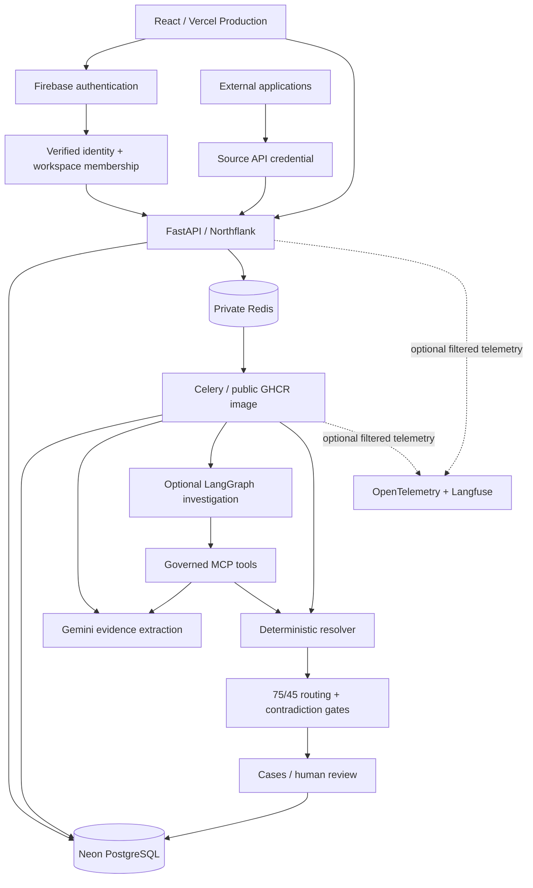

# Contact Resolution Workbench architecture

`main` contains the productized system. The [Contact Resolution Workbench portfolio](https://contact-resolution.vercel.app) has earlier production acceptance; the [October release acceptance](production-release-acceptance-2026-10-11.md) reports the subsequent API/worker rollout and bounded provenance/investigation acceptance. The [4 October audit](final-readiness-audit-2026-10-04.md) preserves local verification and historical release gaps. The [controlled cutover](production-cutover.md) reused the verified Northflank, Neon and Firebase environment. The old POC is tagged `v0-poc`; Render remains temporary rollback insurance.

## Application runtime components

The table describes the intended portfolio architecture, retained deployment evidence and optional implementation. It does not assert that all code at HEAD is deployed.

| Component | Responsibility | Live portfolio |
| --- | --- | --- |
| React / Vite | Authenticated workspace, Sources, ingestion history, Cases and human review | Vercel Production, branch `main` |
| Firebase | Email/password or anonymous identity; backend verifies ID tokens | Verified project `contact-resolution-staging` |
| FastAPI / SQLAlchemy | Membership enforcement, Source contract, Case/Job/investigation APIs | Northflank API |
| PostgreSQL | Workspace-owned domain state, durable Jobs, reference records, provenance, investigation metadata/checkpoints | Isolated Neon branch/database |
| Redis / Celery | Queue internal identifiers; process durable ingestion and explicit investigations | Project-private Redis and existing worker |
| Deterministic resolver | Normalize, retrieve candidates, score, detect contradictions and route at 75/45 | Active for CSV/Source ingestion |
| Gemini structured extraction | Parse/ground evidence within validated schemas | Local provenance tests and user-reported October extraction/provenance acceptance |
| LangGraph / MCP v2 | Governed evidence investigation, deterministic re-analysis, typed human interrupt/resume | Local real-service and earlier production checkpoint evidence; user-reported bounded October start/pause/resume acceptance |
| OTel / Langfuse | Optional allowlisted operational metadata, fail-open export | Disabled in the public deployment |



### Authentication and ownership

Firebase Admin verifies bearer signatures, issuer/audience and expiry using the configured project. Bootstrap derives internal identity from that token and creates the first workspace. `X-Workspace-ID` selects only a workspace for which the verified user has a persisted membership. Cases, Jobs and investigations are filtered by that authorized workspace. Candidate/evidence reads and decisions are rooted in an authorized Case.

Owners manage Sources and credentials; members read safe Source state/history. Machine ingestion uses a distinct credential dependency. The authenticated Source supplies workspace and REFERENCE/INCOMING purpose; caller authority fields are forbidden. Parent-authorized Source history and internal Job/ingestion foreign-key lookups are not independent unscoped user reads. MCP revalidates the durable run's workspace/case relationship and requested resources.

### Dual ingestion contract

```text
CSV incoming import ----------------------+
External applications -> Source API ------+-> durable Job + payload in PostgreSQL
                                            -> Redis (internal identifiers only)
                                            -> Celery atomic PENDING -> RUNNING claim
                                              | REFERENCE: source-scoped master upsert
                                              | INCOMING: candidates -> deterministic score
                                              |           -> contradiction gates -> routing
                                              +-> Job completion + domain transaction
                                                  -> history / Case review
```

CSV currently creates incoming Cases; there is no separate CSV master/reference importer. REFERENCE batches populate the persistent workspace candidate provider. Incoming CSV and Source batches both use `workspace_resolver`, the existing matcher/router and `persist_case_resolution`. Built-in comparison providers remain synthetic demo fixtures, not live CRM integrations. The unstructured extraction task uses the existing resolver. Its current finalization atomically commits the Case, exact originating Job provenance and terminal Job success, with fresh-session verification after ambiguous commit acknowledgement. This updated path has local verification and user-reported bounded October acceptance; the earlier separate-commit analysis is historical. See [atomic finalization](f06-atomic-finalization-2026-10-03.md) and [provenance implementation](f11-ai-provenance-implementation-2026-10-04.md).

REFERENCE uniqueness is `(workspace_id, source_id, external_record_id)`. Updates replace canonical attributes and point to the latest ingestion; historical ingestion receipts remain. Different Sources cannot overwrite each other's external IDs. Disable prevents new submissions while retaining records/history; already accepted batches continue.

HTTP identity is `(source_id, digest(Idempotency-Key), digest(canonical payload))`: matching retries reuse the original ingestion/Job in any state; changed bodies return 409. A database unique constraint protects concurrent receipts. Source namespace makes an identical key on another Source independent. A 202 means durable receipt; Job state reports completion or failure.

CSV and Source workers commit domain changes with terminal Job success. An atomic conditional claim makes ordinary duplicate task deliveries harmless. This is idempotent processing and duplicate-delivery tolerance, not exactly-once execution. Durable receipt precedes broker publication, leaving a producer-death publication gap. There is no transactional outbox, lease/heartbeat or automatic stranded-Job reconciler. Ingestion uses Celery's early-ack default; broker redelivery does not reclaim RUNNING state. See [failure windows and manual recovery](final-audit.md#worker-crash-analysis-and-manual-recovery).

Workspace reference retrieval uses up to eight normalized name tokens plus exact email/phone blocking, then takes 100 records ordered by internal ID. This bounds returned candidates and scoring/persistence work, not database scan cost. It can affect correctness in large or crowded blocks. The separate C1 benchmark scores its complete blocked pool before taking 20 candidates; its recall cannot validate the runtime database cap.

### Identity and AI boundary

Suffix conflicts such as Arthur Jr./Sr. and conflicting explicit full middle names block likely-match routing even at a high score. The model cannot set authoritative scores, choose a workspace, override those gates or submit Accept/Reject. `LIKELY_MATCH` is a routing result; persisted reviewer decisions remain human-owned. Gemini extracts/interprets unverified evidence, deterministic rules score and route, and human reviewers make final decisions. No hallucination-free extraction, calibrated confidence or live model accuracy is established.

New ordinary AI-ingested Cases preserve exact originating Job provenance. The scoped source-context API returns the retained note only after Case/workspace and Job association checks; the note is not duplicated into Case metadata. Extracted job title is context only, role is not scored, and no confidence percentage is invented. Missing or historical associations fail unavailable rather than guessing. This implementation has local verification and user-reported October provenance/reload acceptance; deployed image attestation remains unverified.

```text
Reviewer explicitly starts an unresolved Case investigation
  -> authorized InvestigationRun / server-owned workspace, run, case
  -> LangGraph approved Operation enum
  -> explicit enum-to-MCP-tool mapping
  -> official in-process MCP Client(server) discovery/call
  -> approved synthetic evidence / grounded extraction / idempotent persistence
  -> deterministic re-analysis
  -> evidence outcome or typed human interrupt on the same checkpoint thread
```

There is no arbitrary SQL, HTTP, filesystem or shell tool. Evidence cannot select tools or modify scope. `request_human_review` requests investigation input; it cannot decide identity. The embedded MCP server adds no public endpoint or separate cloud service.

### Privacy and deployment

Job payloads and business evidence belong in the database, not telemetry. OTel spans contain enum/count/timing metadata only; Langfuse receives filtered AI spans through the same sanitized provider. Raw exception events, prompts, responses, rows and credentials are excluded. Both exporters are optional and fail open. First-party usage events accept bounded demo identifiers; callers must keep personal data out of case numbers/referral codes.

The backend image runs as UID/GID 999. The API and worker use the same reported source revision and Dockerfile with different commands. Northflank builds the API; the worker pulls a separately built public GHCR image, so image digests need not match. Earlier migration/checkpoint initialization succeeded, but the retained migration workload does not establish current image equality. The Dockerfile includes application and migration files, not local credential files or test fixtures. Northflank exposes the HTTPS API only; Redis and worker remain private. Redis has no TLS and is project-private, with no HA claim. The verified Neon branch/database and Firebase project now serve the live portfolio, retaining their internal staging names. CORS permits only the exact production and retained Preview origins. Both hostnames are Firebase Authorized Domains.

Runtime bases use `python:3.13-slim` and version-pinned uv; builds resolve image digests but the Python base tag can move. Kubernetes validation images/node are explicitly pinned. No broader immutable-image guarantee is claimed.

## Experiments evaluated and rejected

| Experiment | Finding | Runtime decision |
| --- | --- | --- |
| MiniLM semantic retrieval / deterministic-semantic union | Underperformed deterministic top-1 and added no useful candidate coverage | Rejected; no embedding/vector database runtime |
| Logistic Regression | Synthetic ranking gains depended on asymmetric missing fields | Rejected; no model loading in APIs/workers |
| CPU XGBoost | Same missing-field artifact undermined apparent gains | Rejected |
| Alternative routing thresholds | Insufficient independent validation evidence | Existing 75/45 retained |

Gemini embedding runner exists but was not executed; its performance is unassessed. [Versioned results and methodology](identity-resolution-benchmark.md) preserve both measured gains and rejection reasons.

## Development/validation infrastructure

- Docker packages the runtime; Compose supplies disposable shared PostgreSQL/Redis for local development.
- Kubernetes manifests validate API/worker security contexts and a deliberate migration Job. kind CI uses ephemeral resources, test-only authentication and disposable databases; none of that test injection is deployed publicly.
- Pytest covers authorization, tenant isolation, source contracts, idempotency, rollback, contradiction gates and review ownership. Separate real-service suites cover Redis/Celery delivery and PostgreSQL LangGraph checkpoints.
- Deterministic DeepEval tests scripted JSON and tool contracts with no live judge, login or upload. Optional live judging remains explicit opt-in and was not run.
- Synthetic retrieval/ranking/routing benchmarks and checked-in JSON artifacts support bounded claims; they are not operational accuracy measurements.
- Public browser acceptance and the final authenticated API smoke use legitimate staging Firebase identities and synthetic data.

## Infrastructure ownership and release boundary

Northflank uses its native template and secret configuration. Vercel Production has the five verified frontend variables; branch-specific Preview settings remain available. Cutover read-back confirms two services, one migration job, one private Redis addon and one secret group, with available usage at USD 0. This is account evidence, not a future cost guarantee. Vercel remains Hobby; no resources or plan upgrades were introduced. The portfolio has no enterprise availability or scale SLA.

Terraform was evaluated and intentionally not adopted because the currently managed infrastructure does not benefit from adding Terraform state. No unofficial provider or Terraform state was introduced. GitHub default and Vercel Production Branch remain `main`. Pushing `main` can trigger frontend deployment; the deployed frontend SHA remains unverified. The [October release acceptance](production-release-acceptance-2026-10-11.md) reports API/worker rollout from `324e50b` and bounded provenance/investigation acceptance. Worker memory reached 255.91 MB of 256 MB, no worker health checks are configured, and separate CSV/final reviewer-decision acceptance was not recorded. Long-term memory stability and unrestricted SaaS reliability are not established. Render and the old POC database/auth environment remain available for rollback.
